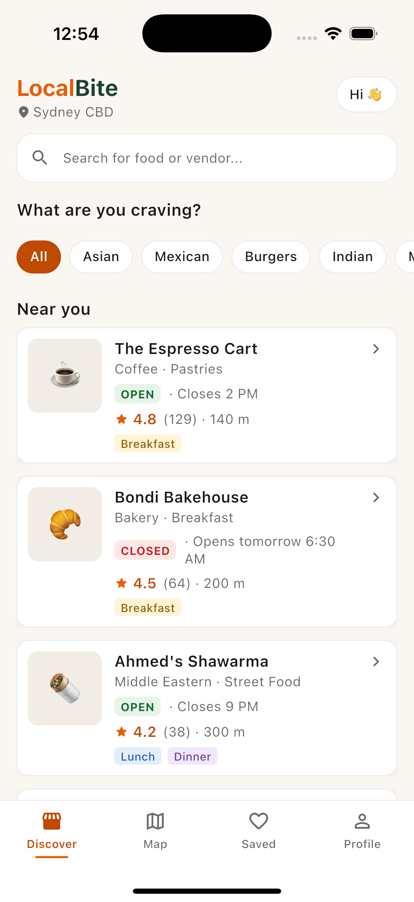
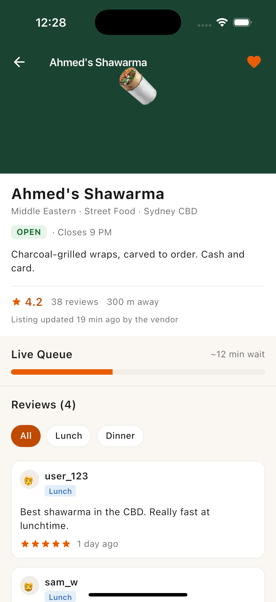
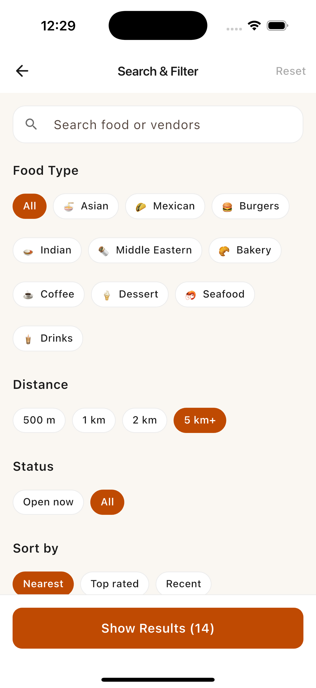
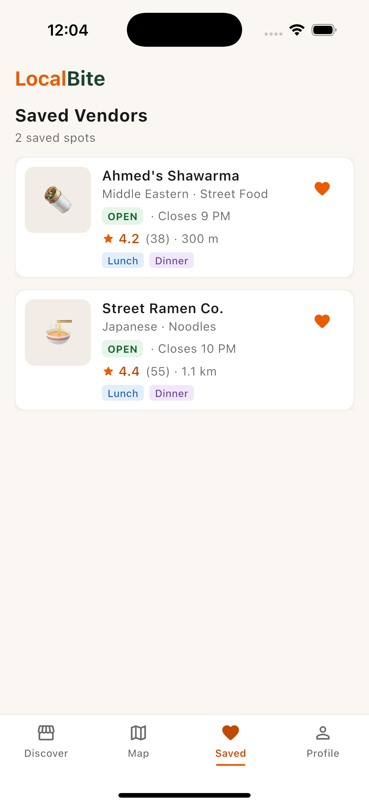
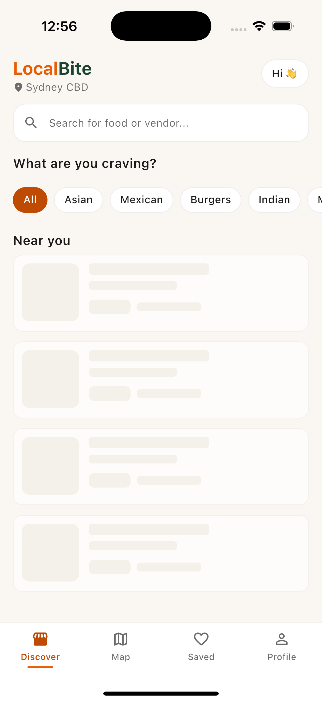
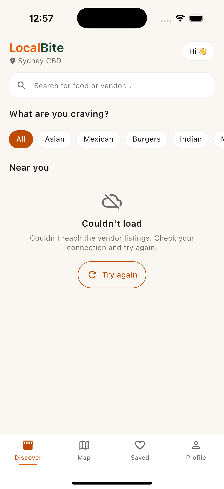
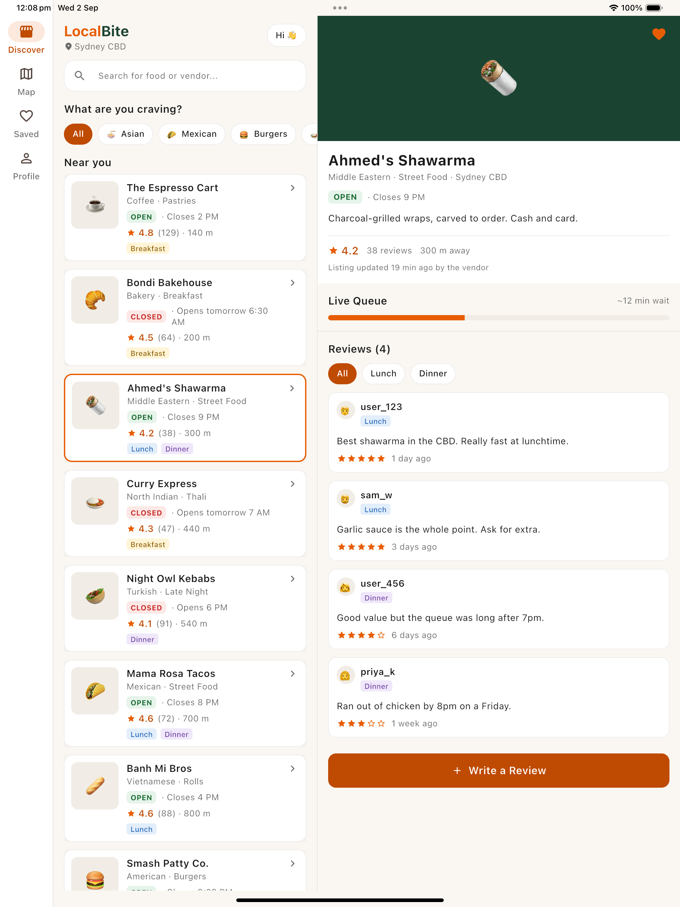

# LocalBite

A food-discovery app for independent Sydney CBD street vendors, built in Flutter.

Google Maps already lists street carts, with a rating and "Open · Closes 9 PM". It lists
them as though they never move. A Maps pin is fixed and the operator rarely controls it,
so a cart that traded on Pitt Street yesterday and Martin Place today shows up in one
place at most. Delivery platforms don't list them at all: registration assumes a fixed
address, set trading hours and online payment, and a cart has none of the three.

LocalBite does the two things neither does. The vendor keeps their own listing, so hours
and position come from the operator. And every review carries the meal period it was
written in, because a lunch rating and a dinner rating describe different queues and
often a different menu.

> ICT725 User Experience and Mobile Application Development — Assessment 4
> Malik Muhammad Daniyal Ahmed (20035852)

**Live web build:** https://localbite-ict725.vercel.app
**Figma prototype:** https://www.figma.com/design/efLOTWMQddlcBYbLZGENEN/LocalBite---Hi-Fi-Prototype--Tutorial-5-Exercise-3-
**Figma wireframes:** https://www.figma.com/design/W0Gtt3GspBDUxk9xTRynor/LocalBite---Wireframes--Tutorial-5-Exercise-2-

## Screens

| Discover | Vendor Detail | Search & Filter | Saved |
|---|---|---|---|
|  |  |  |  |

Loading and failure are designed states, not afterthoughts:

| Loading | Failed load |
|---|---|
|  |  |

The same code adapts to a tablet, swapping the bottom bar for a navigation rail and
showing list and detail side by side:



## Running it

Requires Flutter 3.47+ (built and tested on 3.47.1 / Dart 3.13.1).

```bash
flutter pub get
```

**iOS Simulator** — the target used for the assessment demo:

```bash
xcrun simctl list devices available | grep iPhone
xcrun simctl boot "<device-udid>" && open -a Simulator
flutter run -d <device-udid>
```

**Web:**

```bash
flutter run -d chrome
```

**macOS desktop** — the quickest way to see the responsive breakpoints, since you can
drag the window from phone width to tablet width and watch the layout change:

```bash
flutter run -d macos
```

## Tests

```bash
flutter analyze
flutter test
flutter test integration_test/app_test.dart -d <device-udid>
```

76 unit and widget tests, plus 5 end-to-end tests that drive the real app on a simulator
through the four required flows. The analyzer reports no issues.

The suite covers the parts that are easy to get silently wrong:

| File | What it protects |
|---|---|
| `test/unit/opening_hours_test.dart` | Open/closed derivation, including stalls trading past midnight |
| `test/unit/vendor_query_test.dart` | Filtering, sorting, and clearing nullable filters |
| `test/widget/status_badge_test.dart` | The badge flips on a clock tick with no navigation |
| `test/widget/data_states_test.dart` | Loading, failure, retry recovery, failed review post |
| `test/widget/accessibility_test.dart` | Tap actions, tap targets, labelling, contrast |
| `test/widget/responsive_layout_test.dart` | 320dp to 1024dp, landscape, 2x text scale |
| `integration_test/app_test.dart` | The four required flows on a device |

## What's implemented

| Feature | Status |
|---|---|
| Vendor discovery by proximity and food type | Done |
| Real-time open/closed status | Done |
| Time-of-day reviews (Breakfast/Lunch/Dinner) | Done |
| Saved vendors with live status | Done |
| Search and filter across five dimensions | Done |
| Write a review, with progress and failure handling | Done |
| Live queue estimate | Done |
| Loading, error and retry states | Done |
| Responsive phone / tablet / landscape | Done |
| Map tab | Not built — placeholder |
| Profile and accounts | Not built — needs a backend |
| Persistence across restarts | Not built — in memory only |
| Real vendor data and device GPS | Not built — seeded repository, fixed origin |

## How it's put together

```
lib/
├── domain/     Pure Dart: vendors, reviews, opening hours, filtering. No Flutter imports.
├── data/       Repository interface + the in-memory seed of 14 stalls.
├── state/      Four ChangeNotifiers: clock, catalog, saved, reviews.
├── app/        Composition root, AppScope, route table.
├── screens/    One folder per screen; screen/view split so views embed in a tablet pane.
├── widgets/    Shared components (vendor card, chips, status badge, skeletons, nav).
└── theme/      Design tokens, type scale, breakpoints, reduced-motion helper.
```

**Open/closed status is derived, never stored.** `OpeningHours.statusAt(now)` computes
state and the next transition from the vendor's own hours, so a badge cannot go stale.
It handles stalls trading past midnight by checking the previous day's window first — a
van open 18:00–03:00 correctly reads OPEN at 1am.

**One clock, subscribed at the leaves.** A single `ClockController` ticks on the minute.
Only widgets displaying time-derived content listen, so a tick repaints the status badges
on Discover, Saved and Detail at once without rebuilding the screens holding them.

**No third-party runtime dependencies.** State is `ChangeNotifier` + `ListenableBuilder`
behind an `InheritedWidget`. The reads are deliberately non-subscribing, which is what
keeps the per-minute tick cheap.

**Async repository, on purpose.** It returns futures even though it reads from memory. An
interface that cannot express waiting or failing pushes every screen into a shape that has
no loading or error state at all.

## Accessibility

Contrast was measured against WCAG 2.1 AA before the build, not after. Body text is
16.29:1 on the app background and secondary text 4.99:1. Brand orange `#E85D04` measures
3.50:1, so it is used only for large text and non-text UI; a darker `#BF4A02` (5.01:1)
carries anything smaller. Trading status always spells the word OPEN or CLOSED so it is
never conveyed by colour alone. System text scaling is honoured to 200%, and motion
collapses when the OS asks for reduced motion.

Filter chips and navigation tabs expose real activation actions to assistive technology.
That is worth stating because it was broken: wrapping a tappable control in an excluding
`Semantics` node silently strips its tap action, leaving controls that are labelled but
not operable by Switch Access. Tap-target, labelling and contrast guidelines are now
asserted in the test suite so the regression cannot return unnoticed.
